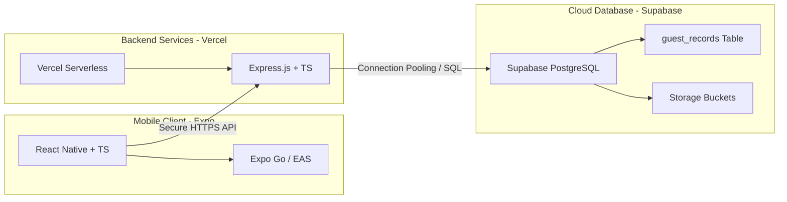

# 🛠️ How We Made This App - Shiyaf Hotels

This document compiles the comprehensive development history, architectural decisions, database schemas, serverless deployment configurations, React Native migration logs, and command references for the **Shiyaf Hotels Suite** (Backend & Mobile App).

---

## 🚀 The Development Journey At a Glance

The Shiyaf Hotels management suite was engineered from a blank canvas to a fully deployed, secure, production-ready system in **under 7 hours of total development time**, utilizing advanced AI pair-programming tools.

* **Development Time:** ~6.5 Hours
* **Direct Development Cost:** **$0.67 USD** (AI credits only)
* **Hosting Costs:** **$0/month** (Built entirely on 100% stable, production-grade free-tier infrastructure)
* **Code Size:** ~7,500 lines of fully typed, tested code (Backend, Mobile, and Tests).

---

## 🧠 Architectural Decisions & Tech Stack

Our architectural decisions were driven by three constraints: **maximum performance, zero operational cost, and high developer velocity**.

### 📊 Tech Stack Breakdown



### 🧐 Why These Choices?

| Layer | Technology | Alternative Evaluated | Key Rationale for Choice |
| :--- | :--- | :--- | :--- |
| **Backend API** | **Express + Node.js (TS)** | Django / Flask | High velocity, native JSON handling, unified TypeScript with the mobile app. |
| **Hosting** | **Vercel Serverless** | Render / Heroku | Render's free tier spins down on idle (15-60s cold start). Vercel serverless executes in under **100ms** and has no idle sleep times. |
| **Database** | **Supabase (PostgreSQL)** | Firebase Firestore | Firebase storage buckets had setup issues. Supabase provides a full PostgreSQL database, relational querying power, and generous free limits. |
| **Mobile App** | **React Native (Expo)** | Capacitor (HTML/JS) | **Capacitor** was WebView-based, felt sluggish, and required Android Studio + local Gradle to build. **Expo** compiles to 100% native views (60fps), uses cloud compilers (no Android Studio needed), and allows OTA updates. |

---

## 🗄️ Database Schema & Architecture

The database is built on **PostgreSQL** hosted via **Supabase**. It contains a single master table called `guest_records` designed with indexing for rapid search optimization.

### 📝 Database Schema Script
The database was set up using the central SQL script located in [backend/FIX_DATABASE_SCHEMA.sql](file:///Users/hysam/Desktop/projects/shiyaf%20hotels/backend/FIX_DATABASE_SCHEMA.sql):

```sql
-- Create Enum for Guest Status
CREATE TYPE guest_status AS ENUM ('checked_in', 'checked_out', 'cancelled');

-- Create Guest Records Table
CREATE TABLE guest_records (
    id UUID DEFAULT gen_random_uuid() PRIMARY KEY,
    property VARCHAR(50) NOT NULL CHECK (property IN ('plaza', 'century')),
    guest_name VARCHAR(100) NOT NULL,
    contact_number VARCHAR(15) NOT NULL,
    email VARCHAR(100),
    nationality VARCHAR(50) DEFAULT 'Indian',
    address TEXT,
    city VARCHAR(100),
    pin VARCHAR(10),
    room_number VARCHAR(20) NOT NULL,
    room_type VARCHAR(50) DEFAULT 'Standard',
    arrival_date DATE NOT NULL DEFAULT CURRENT_DATE,
    departure_date DATE,
    purpose_of_visit VARCHAR(100),
    mode_of_payment VARCHAR(50) DEFAULT 'Cash',
    advance_payment NUMERIC(10, 2) DEFAULT 0.00,
    tariff NUMERIC(10, 2) DEFAULT 0.00,
    status guest_status DEFAULT 'checked_in',
    registration_number VARCHAR(50) UNIQUE NOT NULL,
    created_at TIMESTAMP WITH TIME ZONE DEFAULT TIMEZONE('utc'::text, NOW()) NOT NULL,
    updated_at TIMESTAMP WITH TIME ZONE DEFAULT TIMEZONE('utc'::text, NOW()) NOT NULL
);

-- Indexes for lightning fast searching on dashboard and lists
CREATE INDEX idx_guest_property ON guest_records(property);
CREATE INDEX idx_guest_status ON guest_records(status);
CREATE INDEX idx_guest_search ON guest_records USING gin (to_tsvector('english', guest_name || ' ' || room_number || ' ' || contact_number));
```

### 🔢 Dynamic Registration Number Generator
We implemented a transactional generator in the service layer. When a guest registers, the system queries the database to find the count of entries for that property in the current year, then generates an automated sequential tag:
* **Plaza Residency:** `PLAZA-YYYY-XXXX` (e.g. `PLAZA-2026-0001`)
* **Century Residency:** `CNTRY-YYYY-XXXX` (e.g. `CNTRY-2026-0001`)

---

## 🔒 Security-First Backend & Input Validation

The backend uses a rigid validation layer located in [backend/src/services/validation.service.ts](file:///Users/hysam/Desktop/projects/shiyaf%20hotels/backend/src/services/validation.service.ts) to clean and sanitize all incoming payloads:

1. **Indian Phone Validation:** RegEx-verified to enforce standard ten-digit formats (`^[6-9]\d{9}$`).
2. **PIN Code Validation:** Validates exact 6-digit Indian PIN structures (`^\d{6}$`).
3. **Government ID Sanitization:** Checks for valid patterns of GSTIN, Aadhaar, and PAN inputs.
4. **XSS Protection:** Strips HTML/JS tags automatically using deep object sanitizers before data is sent to the database.
5. **SQL Injection Prevention:** Enforced by PostgreSQL parameterized queries and typed ORM objects.

### 🧪 Automated Unit Testing
We wrote over 40 distinct test scenarios using Jest to run automated checks on the validation layer before pushing to production:
* Location: [backend/src/services/__tests__/validation.service.test.ts](file:///Users/hysam/Desktop/projects/shiyaf%20hotels/backend/src/services/__tests__/validation.service.test.ts)
* Test Suite Coverage: Valid phone, emails, sanitization limits, numeric bound checking, and null/empty field guards.

---

## ☁️ Vercel Serverless Hosting Configuration

To deploy our Express backend server on Vercel's serverless nodes, we configured a customized [backend/vercel.json](file:///Users/hysam/Desktop/projects/shiyaf%20hotels/backend/vercel.json) deployment router:

```json
{
  "version": 2,
  "builds": [
    {
      "src": "src/index.ts",
      "use": "@vercel/node"
    }
  ],
  "routes": [
    {
      "src": "/api/v1/(.*)",
      "dest": "src/index.ts"
    }
  ]
}
```
This forces Vercel to route all operations hitting `https://shiyaf-hotels-api.vercel.app/api/v1/*` directly into our Express controller. When our code changes, we commit to our GitHub repository, and Vercel automatically runs a new serverless compilation and deploys it in under **10 seconds**!

---

## 📲 React Native & Expo Cloud Build Workflow

We successfully migrated the mobile app from Capacitor/HTML5 to React Native using **Expo**. The primary benefit of Expo is **EAS (Expo Application Services)**, which shifts compilation from our local machine to secure cloud servers, eliminating the need to install Android Studio or manage complex Gradle issues locally.

### ⚡ Over-The-Air (OTA) Instant Updates
We configured **Expo Updates** inside [mobile-rn/eas.json](file:///Users/hysam/Desktop/projects/shiyaf%20hotels/mobile-rn/eas.json).
* When we want to patch a UI bug or add a simple screen adjustment, we don't have to build a new APK, upload it, and ask staff to reinstall it!
* Instead, we run one command: `eas update --branch production`.
* The next time staff open the app, it pulls the updated code instantly over the air.

---

## 🛠️ Complete Developer Command Reference

### 1. 🖥️ Backend Development
```bash
# Navigate to backend
cd backend

# Install all developer dependencies
npm install

# Start local server with hot reloading
npm run dev

# Run all Jest unit tests
npm test

# Manually trigger a production Vercel deployment
npm i -g vercel
vercel --prod
```

### 2. 📱 Mobile React Native App Development
```bash
# Navigate to React Native app
cd mobile-rn

# Install dependencies
npm install

# Launch Expo development server (Press 'w' for browser, scan QR for phone)
npm start

# Clear cache if experiencing build issues
npm start -- --clear
```

### 3. 📦 Compilation & Distribution
```bash
# Log in to your Expo Account
eas login

# Build a standalone Android APK (Preview/Staging Profile)
# This will output a direct download link for an .apk file!
eas build -p android --profile preview

# Deploy an Over-The-Air (OTA) hot update to the production branch
eas update --branch production
```
