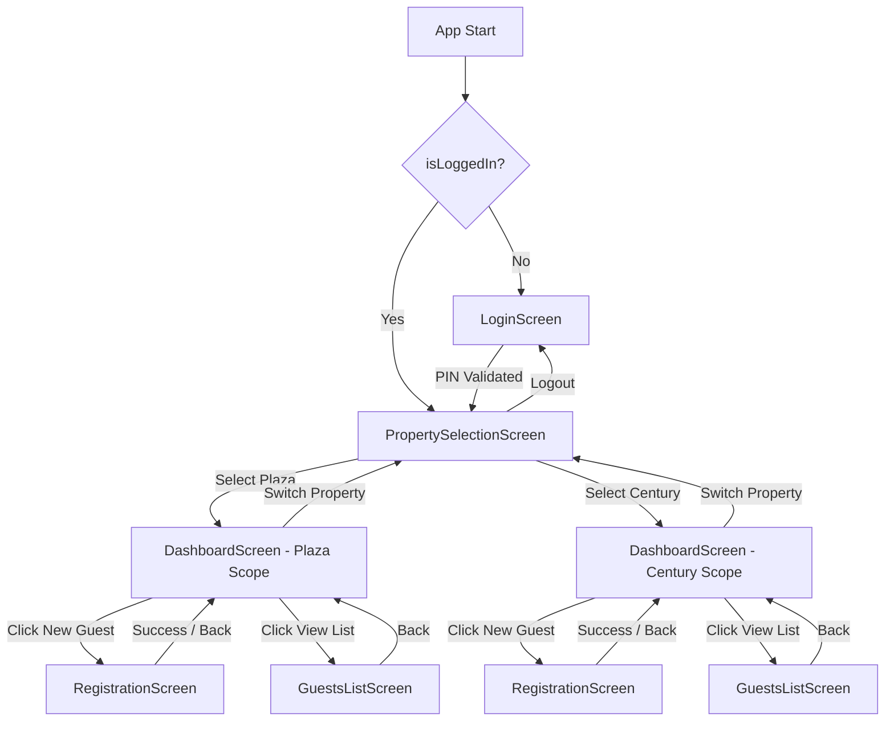

# 📱 Shiyaf Hotels - UI and App Structure

This document provides a comprehensive guide to the user interface (UI) structure, routing flow, component architecture, styling design system, and working mechanisms of the **Shiyaf Hotels React Native application** (located in [mobile-rn/](file:///Users/hysam/Desktop/projects/shiyaf%20hotels/mobile-rn)).

---

## 🏛️ Architecture & Routing Overview

The app is built using **React Native with Expo** and **TypeScript** for absolute type-safety. To maintain speed and simplicity, the application uses a centralized state-driven router in [App.tsx](file:///Users/hysam/Desktop/projects/shiyaf%20hotels/mobile-rn/App.tsx) to manage view transitions based on login state and property selection, rather than using complex navigation libraries (like React Navigation).

### 🔄 Screen State Flow

Below is the state routing diagram illustrating how views are rendered based on user interactions:



---

## 📂 Codebase Directory Structure

The active React Native application is structured modularly within the [mobile-rn/src](file:///Users/hysam/Desktop/projects/shiyaf%20hotels/mobile-rn/src) folder:

```
mobile-rn/src/
├── config/
│   └── api.ts                  # Backend URL & timeout settings
├── screens/
│   ├── LoginScreen.tsx         # Secure PIN Login view
│   ├── PropertySelectionScreen.tsx # Branch Selection (Plaza / Century)
│   ├── DashboardScreen.tsx     # Occupancy stats & action grid
│   ├── RegistrationScreen.tsx  # Dynamic Guest Check-in Form
│   └── GuestsListScreen.tsx    # Live Guest ledger, Search, and Checkout
├── services/
│   └── api.ts                  # Axios wrapper & Supabase integration API
├── theme/
│   ├── colors.ts               # Premium Navy/Gold branding color tokens
│   └── spacing.ts              # Absolute spacing scale tokens
└── types/
    └── index.ts                # TypeScript interfaces and models
```

---

## 📺 Detailed Screen Walkthroughs

### 1. 🔑 Login Screen
- **File Location:** [LoginScreen.tsx](file:///Users/hysam/Desktop/projects/shiyaf%20hotels/mobile-rn/src/screens/LoginScreen.tsx)
- **Role:** Secures the hotel administration systems from unauthorized access.
- **Mechanisms:**
  - Standardized PIN-based entry field.
  - Hardcoded PIN verification value (`1234`) configured centrally in `src/config/api.ts`.
  - Securely stores authentication status in local device storage utilizing `@react-native-async-storage/async-storage` for persistent sessions.
  - **Aesthetics:** A dark gold theme incorporating interactive touch pads, animated error indicators for wrong entry inputs, and responsive layout scaling for phone screens.

### 2. 🏨 Property Selection Screen
- **File Location:** [PropertySelectionScreen.tsx](file:///Users/hysam/Desktop/projects/shiyaf%20hotels/mobile-rn/src/screens/PropertySelectionScreen.tsx)
- **Role:** Sets the operational scope of the application to either **Plaza Residency** or **Century Residency**.
- **Mechanisms:**
  - Renders large interactive selector cards for each branch with corresponding localized titles and subtitles.
  - Scopes all subsequent dashboard metrics, guest registration processes, and list databases to the chosen property.
  - Provides a secure "Logout" button at the top header that wipes persistent credentials from local device storage and redirects to the Login screen.

### 3. 📊 Dashboard Screen
- **File Location:** [DashboardScreen.tsx](file:///Users/hysam/Desktop/projects/shiyaf%20hotels/mobile-rn/src/screens/DashboardScreen.tsx)
- **Role:** Operates as the central command dashboard for hotel desk staff.
- **Mechanisms:**
  - Displays 4 live key metric cards:
    1. **Today's Bookings:** Number of guests who arrived today.
    2. **Occupied Rooms:** Total rooms currently occupied.
    3. **Expected Departures:** Guests scheduled to check out today.
    4. **Checked-In Today:** Active registrations recorded today.
  - Includes a quick navigation grid to launch the **New Guest Form** or **Guest Ledger**.
  - Implements **Swipe-to-Refresh** gesture functionality utilizing native ScrollView indicators.
  - Displays localized status headers (e.g. `Century Residency Dashboard`).

### 4. 📝 Registration Screen (Form)
- **File Location:** [RegistrationScreen.tsx](file:///Users/hysam/Desktop/projects/shiyaf%20hotels/mobile-rn/src/screens/RegistrationScreen.tsx)
- **Role:** Handles guest data capture and checkout scheduling.
- **Mechanisms:**
  - Provides a modular scrollable form containing text inputs, numeric pads, and selection dropdowns.
  - Captures full guest profiles including Name, Contact Number, Email, Nationality, Room Number, Room Type (Deluxe, Suite, Standard), Purpose of Visit, Tariff, and Advance Payments.
  - Implements client-side checks verifying that required items are completed, contact numbers conform to Indian formatting (10 digits), and numeric figures are valid.
  - Transmits data securely to the Express backend, which generates an automated, indexed registration number (e.g., `PLAZA-2026-0001` or `CNTRY-2026-0001`).

### 5. 📋 Guests List & Search Screen
- **File Location:** [GuestsListScreen.tsx](file:///Users/hysam/Desktop/projects/shiyaf%20hotels/mobile-rn/src/screens/GuestsListScreen.tsx)
- **Role:** Operates as the live directory list of hotel occupants.
- **Mechanisms:**
  - Fetches the guest collection from the backend, scoped to the current property branch.
  - Incorporates a lightning-fast search input filtering by **Name**, **Room Number**, or **Phone Number** in real-time.
  - Renders color-coded operational status badges (Green for `Checked In`, Grey for `Checked Out`, Red for `Cancelled`).
  - Supports card expandability: tapping a guest card expands it dynamically using standard animations to reveal room rates, payments, check-in timestamps, and emails.
  - Integrates a **One-Tap Checkout** button: updates the backend database instantly and updates the UI state without full screen reloads.

---

## 🎨 Premium Design System

The application employs a highly polished styling framework using React Native `StyleSheet` objects, using absolute branding colors from [colors.ts](file:///Users/hysam/Desktop/projects/shiyaf%20hotels/mobile-rn/src/theme/colors.ts) and a strict 8px spatial grid from [spacing.ts](file:///Users/hysam/Desktop/projects/shiyaf%20hotels/mobile-rn/src/theme/spacing.ts).

### 🎨 Color Palette Reference

| Token Name | Hex Value | visual Mockup | Usage Area |
| :--- | :--- | :---: | :--- |
| `primary` (Navy) | `#1A2744` | 🟦 | Header backgrounds, primary buttons, dark themed text |
| `accent` (Gold) | `#C9A84C` | 🟨 | Selected states, borders, brand icons, logo highlights |
| `success` (Green) | `#4CAF50` | 🟩 | Checked In status badge, checkout confirmation alerts |
| `error` (Red) | `#F44336` | 🟥 | Checked Out badge, invalid form highlights, delete states |
| `background` | `#F8F9FB` | ⬜ | App container canvas background |
| `card` | `#FFFFFF` | ⬜ | Item cards, form inputs, dialog overlays |

### 📏 Spacing Scale

The layout uses a mathematical scale of multiples of 4px and 8px to ensure exact grid alignment:
* `xs`: **4px** — Subtle text offsets, badge paddings
* `sm`: **8px** — Input-to-label gaps, list spacing
* `md`: **16px** — Standard outer container paddings, content gaps
* `lg`: **24px** — Title paddings, button heights
* `xl`: **32px** — Section headings, card spacers
* `xxl`: **48px** — Top safe area alignments, logos

---

## 🔄 Data Synchronization & Network Handling

The application communicates with the backend via [src/services/api.ts](file:///Users/hysam/Desktop/projects/shiyaf%20hotels/mobile-rn/src/services/api.ts) using **Axios**.

### 🛠️ Robust Network Resilience
1. **Timeout Control:** Request timeout limits are capped at **5 seconds** (configured in [src/config/api.ts](file:///Users/hysam/Desktop/projects/shiyaf%20hotels/mobile-rn/src/config/api.ts)). If a connection stalls (common on hotel lobby Wi-Fi), the request halts gracefully and prompts a localized retry screen.
2. **Error Translation:** Axios interceptors capture API failures and convert raw technical stack errors into friendly, user-facing alert messages (e.g. *"No response from server. Please check your internet connection"*).
3. **Optimistic UI:** State changes (like Guest Checkout transitions) occur instantly on the screen while the API syncs in the background, making the UI feel incredibly responsive.
